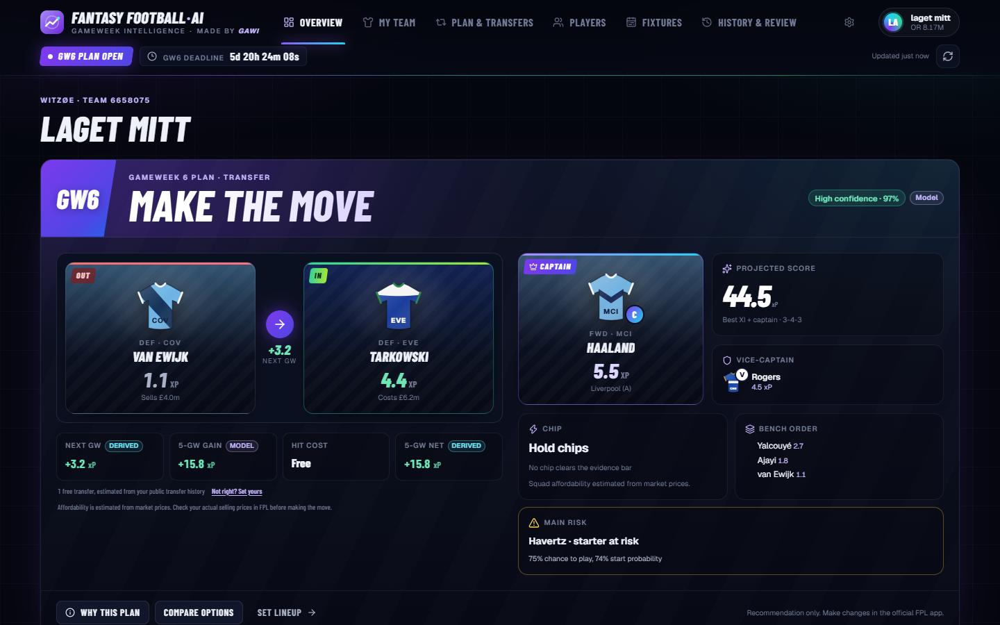
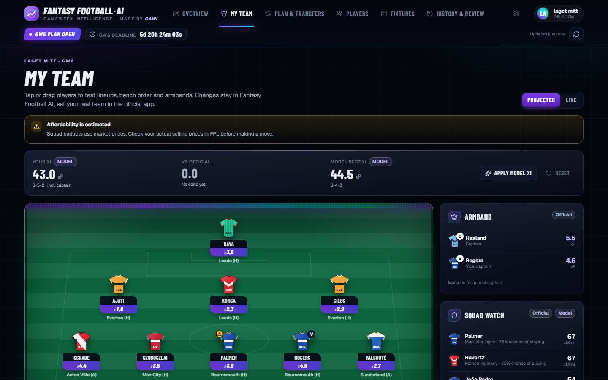
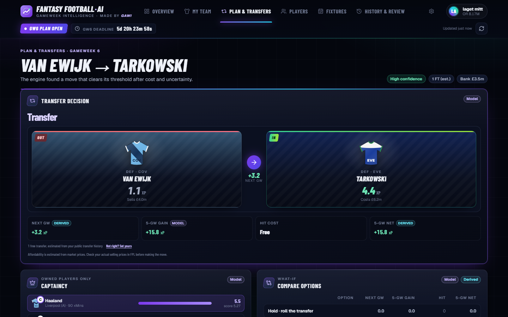
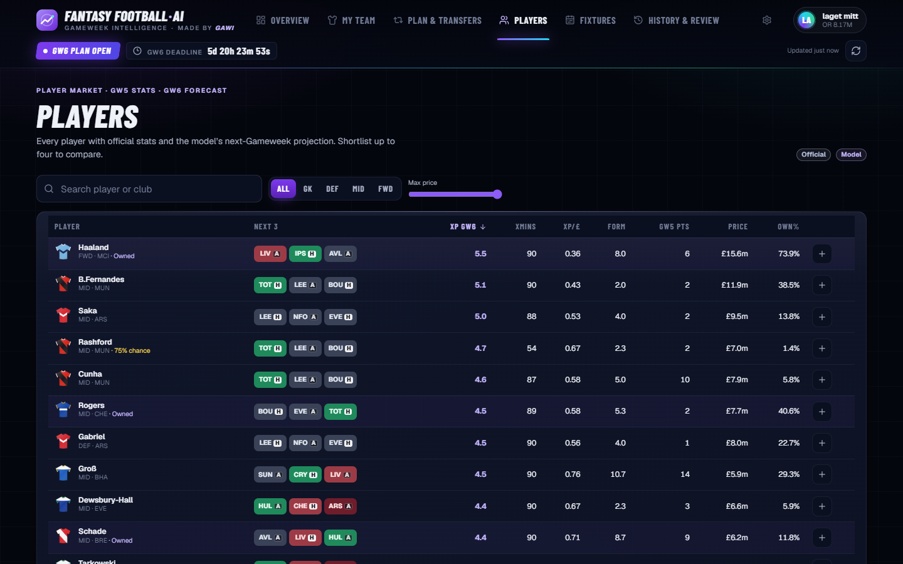
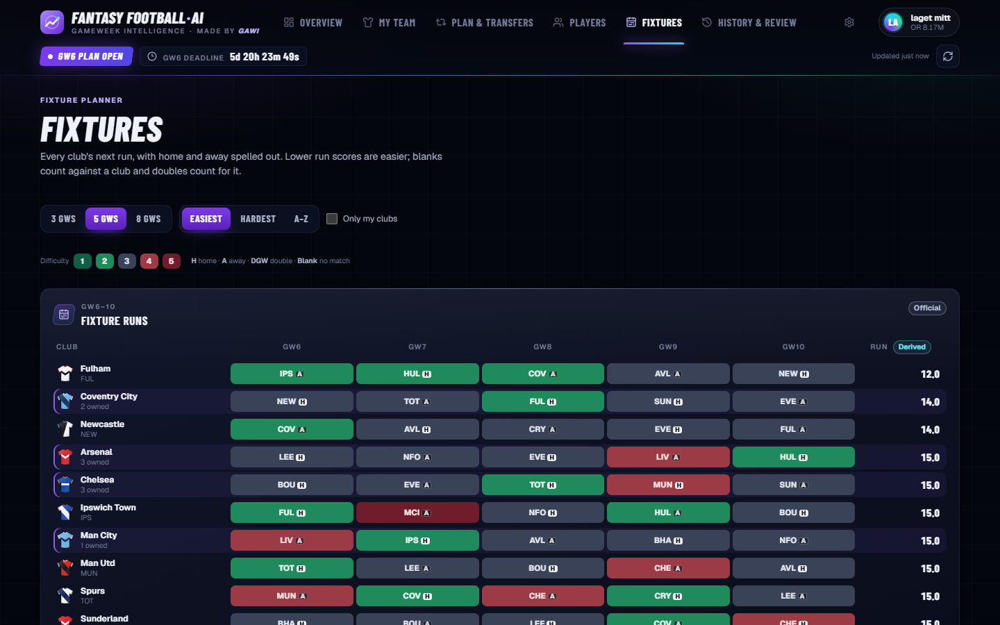
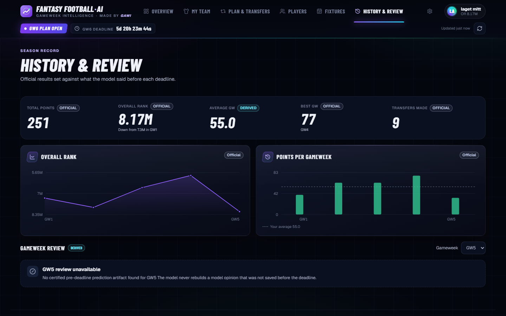
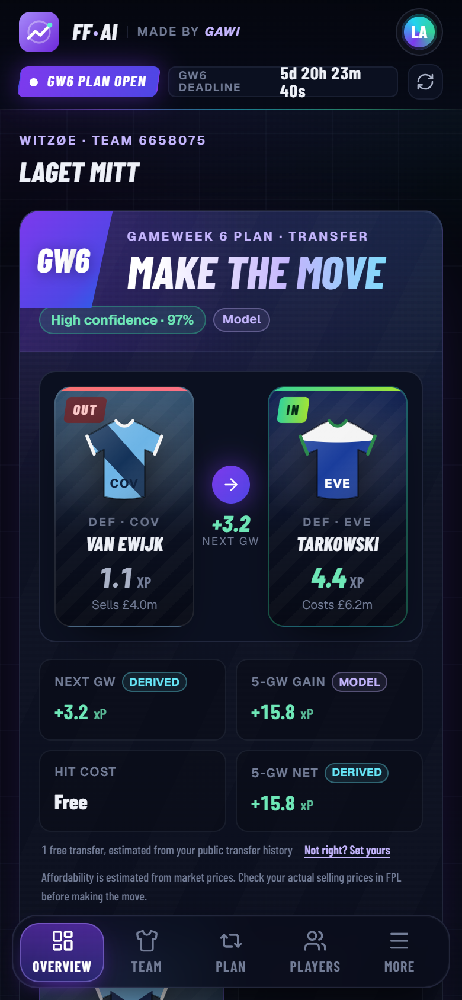
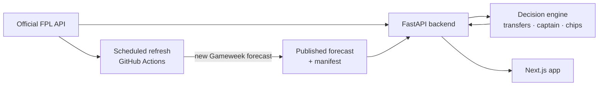

# Fantasy Football AI

**Gameweek intelligence for Fantasy Premier League managers.** Connect your
public Team ID and get a plan for the next deadline: which transfer to make,
who to captain, which chip to hold, and how your squad looks over the next five
Gameweeks, all from a validated points model and the official FPL data.

**Live app:** [fantasyfootball-ai.vercel.app](https://fantasyfootball-ai.vercel.app)

[](https://github.com/GAWI01/fantasy-football-ai/actions/workflows/refresh-predictions.yml)

> Free, independent, non-commercial beta. Not affiliated with or endorsed by
> the Premier League or Fantasy Premier League. Recommendations only: make
> your changes in the official FPL app.



## What it does

| | |
|---|---|
| **Gameweek plan** | One recommendation for the next deadline: transfer (or roll), captain and vice, chip decision, bench order and the main risk in your XI, with a confidence level and the reasoning behind it. |
| **My Team** | Your squad on a pitch with each player's forecast. Drag or tap to test lineups, bench order and armbands; formations stay legal. |
| **Plan & Transfers** | Complete transfer plans searched together (budget, positions and the three-per-club rule apply to the whole plan), compared over one and five Gameweeks including hit costs. |
| **Players** | Every player with official stats, the next-Gameweek forecast, expected minutes, value per million and the next three fixtures. |
| **Fixtures** | Every club's next 3, 5 or 8 Gameweeks with official difficulty, blanks and doubles. |
| **History & Review** | Your season record, and each Gameweek's result set against the forecast that was published before its deadline. |
| **Live** | During a Gameweek: live points against the model's pre-deadline expectation, with official multipliers (Triple Captain, Bench Boost, vice-captain). |

<table>
  <tr>
    <td width="50%"></td>
    <td width="50%"></td>
  </tr>
  <tr>
    <td><b>My Team</b>: test lineups against the forecast.</td>
    <td><b>Plan & Transfers</b>: the recommended move and its alternatives.</td>
  </tr>
  <tr>
    <td></td>
    <td></td>
  </tr>
  <tr>
    <td><b>Players</b>: GW stats and next-GW forecast side by side.</td>
    <td><b>Fixtures</b>: runs ranked from easiest to hardest.</td>
  </tr>
  <tr>
    <td></td>
    <td align="center"></td>
  </tr>
  <tr>
    <td><b>History & Review</b>: the season so far.</td>
    <td><b>Mobile</b>: the same plan on a phone.</td>
  </tr>
</table>

Every number is labelled by where it comes from: **Official** (FPL),
**Model** (the forecast) or **Derived** (calculated from both). When something
is uncertain, the app says so: estimated selling prices, unavailable
forecasts and players flagged by official injury news are marked rather than
hidden.

## How it works



- **Backend** (`backend/`, FastAPI): reads public FPL data at request time
  through a cached, rate-limited gateway, applies the latest official
  availability, prices and names to the forecast, and runs the decision engine.
  No FPL login or API key is needed.
- **Decision engine** (`decision_engine.py`, `transfer_analysis.py`,
  `optimizer/`): a mixed-integer search over complete transfer plans, captain
  selection, chip scenarios measured against the lineup the plan recommends,
  and a five-Gameweek horizon.
- **Frontend** (`frontend/`, Next.js): the responsive app shown above. It
  checks that every forecast belongs to the Gameweek it is shown for.
- **Forecasts** (`historical_data/`): a scheduled workflow refreshes official
  data every three hours. Once a Gameweek has final scores it publishes the next
  Gameweek's forecast and commits it to `master`, which deploys the API
  (Railway) and the app (Vercel).

## The model

The forecast is a gradient-boosting model of each player's points per fixture
(`models/fpl_model_v4.pkl`), built from the player's last five completed
Gameweeks (points, minutes, starts, goals, assists, BPS and ICT), how many of
those Gameweeks exist yet, price,
position, home or away, and the official fixture difficulty. Training,
validation and live forecasting share one feature implementation, so live
inputs are computed exactly as in training.

It was trained on 2020-21 to 2025-26 and certified on the current season's
completed Gameweeks (2026-27 GW1–5), which it never saw:

| At certification (October 2026) | Mean abs. error | RMSE | Points of its top 10 per GW |
|---|---|---|---|
| **Model** | **1.256** | **2.230** | **6.06** |
| Baseline: last-five average | 1.350 | 2.650 | 3.46 |

A model is certified only if it beats that baseline, its features provably
ignore results from the Gameweek being forecast, and the live path reproduces
the validation inputs exactly. After every Gameweek the forecast is scored
against the final points (`historical_data/current_data/forecast_checks.csv`),
so drift shows up within a week. Forecasts are expected points, not
guarantees: one player's Gameweek is very random, and the five-Gameweek
outlook scales next week's forecast by fixture difficulty rather than
forecasting each week separately. The method, limitations and commands are in
[docs/MODEL_PIPELINE.md](docs/MODEL_PIPELINE.md).

## Run it locally

You need the numeric Team ID from your FPL URL, e.g.
`https://fantasy.premierleague.com/entry/1234567/event/1`.

**Docker Compose** (backend on port 8000, app on port 3000):

```bash
git clone https://github.com/GAWI01/fantasy-football-ai.git
cd fantasy-football-ai
docker compose up --build
```

**Development servers** (Python 3.12+, Node.js 22+, pnpm via Corepack):

```bash
python -m venv .venv
source .venv/bin/activate        # Windows: .\.venv\Scripts\Activate.ps1
python -m pip install -r requirements.txt -r backend/requirements.txt
python -m uvicorn backend.main:app --reload --port 8000
```

In a second terminal:

```bash
cd frontend
corepack enable
pnpm install --frozen-lockfile
cp ../.env.example .env.local    # Windows: Copy-Item ..\.env.example .env.local
pnpm dev
```

Open `http://localhost:3000`. The API answers `{"status":"ok"}` at
`http://localhost:8000/health`, and `/api/v1/status` reports whether the
forecast matches the official next Gameweek.

| Variable | Purpose | Local default |
|---|---|---|
| `NEXT_PUBLIC_API_URL` | Backend origin, compiled into the app | `http://127.0.0.1:8000` |
| `FPL_AI_CORS_ORIGINS` | App origins the API accepts | `http://localhost:3000,http://127.0.0.1:3000` |

## Tests

```bash
python -m pytest                         # backend, decision engine, model pipeline
cd frontend && pnpm test && pnpm lint && pnpm exec tsc --noEmit
```

To refresh data and publish a due forecast by hand:
`python -m historical_data.refresh_predictions`. To retrain and recertify the
model: `python -m historical_data.validate_model`.

## Repository

| Path | Contents |
|---|---|
| `frontend/` | Next.js app |
| `backend/` | FastAPI API, FPL gateway, forecast manifest and serving checks |
| `decision_engine.py`, `transfer_analysis.py`, `optimizer/` | Transfer, captain, lineup and chip decisions |
| `historical_data/` | Season data, feature building, training, validation and forecast publishing |
| `models/` | The certified model with its validation report and certificate |
| `tests/` | Python test suite |
| `docs/` | Model pipeline, deployment, data sources and product notes |

## Deployment

Merging to `master` deploys automatically: Railway builds the API from
`Dockerfile.backend` and Vercel builds the app from `frontend/`. See
[docs/DEPLOYMENT.md](docs/DEPLOYMENT.md).

## Data and rights

Live data comes from the public Fantasy Premier League API; historical seasons
come from [vaastav/Fantasy-Premier-League](https://github.com/vaastav/Fantasy-Premier-League).
FPL and Premier League data, names and marks belong to their owners. This
project is free and non-commercial; see [docs/DATA_SOURCES.md](docs/DATA_SOURCES.md)
and the conditions in [docs/DATA_USE_RELEASE_GATE.md](docs/DATA_USE_RELEASE_GATE.md).

Made by [GAWI01](https://github.com/GAWI01).
